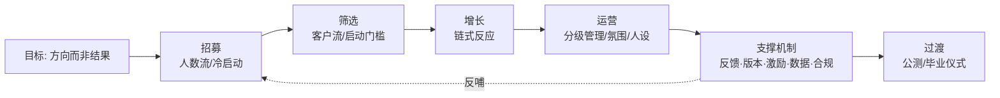

# 熵减内测招募与运营手册（Beta Recruitment Playbook）

> 定位：将"内测人员招募"从一次性动作变为可复制的运营体系。
> 核心逻辑链：**明确目标 → 招募（找到人）→ 筛选（找对人）→ 增长（人带人）→ 运营（留住人）→ 支撑机制（反馈/版本/激励/数据）→ 过渡与毕业**。
> 底层原则：所有策略的核心是**真诚**和**价值交换**——技术、心理、运营技巧都是辅助，真正的增长引擎是对用户需求的深刻理解和产品的持续迭代。

关联文档：[内测简介](./beta-tester-intro.md) · [用户反馈与支持规范](../standards/user-feedback-support.md) · [痛点图谱](./pain-points.md)

---

## 0. 总览

---

## 1. 目标：方向而非结果

- 目标是**方向**（"获得真实反馈以打磨产品"），不是执念数字（"必须招到 100 人"）。
- 设定**过程目标**而非仅结果目标：如"每周与 3 位内测用户深度对话"、"每两周发一个内测版本"。
- **科学依据**：目标设置理论——明确、可接受、有反馈的目标才能提升绩效；把方向拆成可执行的过程目标并定期回顾。
- ⚠️ **样本量校正（Nielsen 定律）**：5 个用户即可发现约 85% 的可用性问题。内测早期 **5-10 人的深度沟通 > 100 人潜水**。人数焦虑是伪命题，深度才是稀缺品。

**熵减的内测北极星（建议）**：

| 阶段 | 北极星指标 | 辅助指标 |
|------|-----------|---------|
| 首批（5-10 人） | 每人 ≥1 次深度访谈 | 课堂助手笔记质量评分 |
| 二批（20-50 人） | 次周留存率 | 有效反馈条数/周 |
| 公测前 | Sean Ellis PMF 测试 ≥40% | 激活率（首次完成一次完整学习闭环） |

> Sean Ellis PMF 测试：问"如果不能再使用熵减，你的感受？"，"非常失望"占比 ≥40% 即接近产品市场匹配。

---

## 2. 招募：人数流与冷启动

### 2.1 先分清阶段

- **种子用户**：产品理念形成期的共创者，认同愿景，容忍粗糙。
- **内测用户**：功能验证期的测试者，关注可用性。
- 熵减当前处于两者之间：首批按种子用户标准找（认同"本地优先 + AI 增强"理念的学习者），二批起按内测用户标准扩。

### 2.2 冷启动渠道（结合熵减实际）

目标用户是**学生与终身学习者**，渠道优先级：

| 优先级 | 渠道 | 理由 |
|--------|------|------|
| ⭐⭐⭐ | 身边关系链（同学/学习搭子/社群熟人） | 信任成本最低，首批 5-10 人来源 |
| ⭐⭐⭐ | B 站学习区 / 小红书学习博主评论区 | 目标用户密度最高 |
| ⭐⭐ | 考研群、考证群、QQ 学习群 | 学生群体主阵地在 QQ 而非企微，触达渠道要跟着用户走 |
| ⭐⭐ | 少数派、V2EX、Obsidian/Notion 中文社区 | 工具型早期采用者聚集地，反馈质量高 |
| ⭐ | 知乎、公众号长文 | 内容吸引，慢热但可持续 |

- 招募贴清晰说明：项目愿景、对内测者的价值、预计投入时间、**退出机制**（明示可随时退出，反而降低加入的风险感知）。
- **科学依据**：社会认同理论（人们参照他人行为决策）、社会促进效应（可感知的活跃社区激发参与）。

### 2.3 内容吸引：Build in Public（公开开发日记）

比"营造繁荣感"更安全、更可持续的路线：定期公开真实的开发进度、踩坑记录、设计取舍。真实过程本身就是内容，天然积累信任与关注（详见 §6.3 红线）。

### 2.4 加上微信后的第一次对话（破冰 SOP）

加上好友 ≠ 完成招募。前 3 次对话决定对方是成为共创者还是躺在通讯录里。核心心法：**先聊"他"，再聊"产品"——把自己定位成"同为学习者的开发者"，而不是"来推销软件的人"。**

**第一步：开场（加上后 5 分钟内发，趁场景热度）**

- 结构 = 自报家门 + 说明来源 + 一句真诚的钩子，一条消息说完，不刷屏：
  > "你好呀，我是熵减的开发者（就我一个人在做😂）。看到你在 xx 群里说网课记笔记很痛苦，我做这个软件就是因为自己被这事折磨过——想先听听你平时是怎么学的？"
- 三个要点：**坦白单人开发**（真实感即信任感）、**引用对方说过的话**（证明你看见了他，不是群发）、**结尾是关于他的开放问题**（不是"要不要试试我的软件"）。
- 🚫 不要：加上就甩下载链接/长篇产品介绍/连发多条——这是推销行为，瞬间触发心理防御。

**第二步：破冰话题清单（聊什么）**

按"他的痛点 → 他的现状 → 你的故事"推进，产品放最后：

| 话题 | 示例问法 | 目的 |
|------|---------|------|
| 学习场景 | "你最近主要在学什么？考研还是技术？" | 建立画像，判断价值匹配（§3.1） |
| 痛点挖掘 | "看网课的时候，暂停记笔记这事你怎么处理的？" | 对照[痛点图谱](./pain-points.md)验证需求，他吐槽越多参与意愿越强 |
| 现有方案 | "现在用什么工具？Notion？纸笔？" | 了解竞品心智，找切入点 |
| 自我表露 | "我当年复习就是笔记记了一堆从来不看，所以才做了闪卡功能" | 用自己的失败经历换取对方的真实吐槽 |
| 产品（最后才聊） | "你刚说的这个问题，我软件里正好有个功能在解决，想不想帮我看看它做得对不对？" | 把"下载试用"重构为"请你来评判"，给对方专家位置 |

**第三步：首周跟进节奏**

- D0 破冰 → D1-2 发内测包 + 一句"卡在哪随时喊我" → D3-4 主动问一次首次体验（只问一个具体问题，如"课堂助手生成的笔记你觉得能用吗"）→ D7 视活跃度决定拉群或轻量维持。
- 每次对话记录关键信息（学什么、痛点、用什么工具），存入用户标签（§5.1）——下次开口能接上上次的话，信任是"被记住"堆出来的。

**科学依据**：

- **自我表露互惠**：先适度暴露自己的弱点（单人开发、自己的学习失败史），对方会回以同等深度的真实信息。
- **相似性吸引**："我也被网课折磨过"的同类身份，比"我的产品很强"的权威身份更快建立好感。
- **互惠原理**：先给价值再提请求——破冰期可以先分享一个学习方法/资源，而不是先要对方花时间测试。
- **富兰克林效应**：请对方"帮个小忙"（帮我看看这功能做得对不对）反而比"给对方好处"更能拉近关系——人会为自己的付出行为寻找合理化（"我帮他是因为我认可他"）。

⚠️ **红线**：破冰话术可以有模板，但每条消息必须含有"只属于这个人"的信息（他说过的话、他的学习场景）。纯模板群发一旦被识破，§3.2 建立的所有信任清零。

---

## 3. 筛选：客户流与启动门槛

### 3.1 基本条件：价值匹配

内测者要么有强烈需求痛点（网课低效、复习无序——见[痛点图谱](./pain-points.md)），要么能从产品获得直接收益（效率提升）。不匹配的人进来只会稀释信噪比。

### 3.2 安全性说明：建立信任

- 定期、透明同步项目进展、开发者背景、数据使用政策。
- 发布简版《内测协议》：数据安全、反馈时限、退出机制、双方权责。
- 熵减的天然优势要讲透：**本地优先存储、敏感数据加密、云端同步完全可选**——这本身就是最强的信任背书。
- **科学依据**：信任的认知三维度（能力、正直、仁慈）——公开开发过程展示能力与正直，数据保护承诺体现仁慈。

### 3.3 风险告知与承担

- 明示风险类型：时间风险（投入但产品可能调整）、效能风险（内测版不稳定）、隐私风险（及对应保护措施）。
- 提供"后悔权"：随时无条件退出，数据可完整导出。
- 建立反馈响应机制与奖励计划，把用户从"风险承担者"转变为"共创者"。
- **科学依据**：风险感知理论——风险被明确告知并给出应对方案时，感知风险显著降低。

### 3.4 最低启动门槛

- 定最低要求：如"每周至少使用 3 次"、"提交至少 1 条有效反馈"。既筛认真用户，又给出行动框架。
- **申请表即承诺装置**：让申请者写一段"为什么想参加内测"——公开承诺提升后续留存（承诺一致性原理）。
- **科学依据**：登门槛效应——先接受小要求，后续接受更大要求（深度测试、访谈）的概率更高。

---

## 4. 增长：链式反应

- **邀请制**：首批用户发放邀请码，邀请者成为二批，形成链式扩散。
- 推荐奖励与产品核心价值绑定（高级功能、专属通道、更新日志署名），而非纯物质激励——吸引真正有需求的人。
- **内测等级**：首批为"资深内测员"，享更早体验新功能等权益，满足独特感与身份认同。
- **科学依据**：六度分隔理论（关系链是最低成本增长路径）、创新扩散理论（首批用户属"创新者/早期采用者"，其人际网络聚集同类）。
- ⚠️ **幸存者偏差警示**：邀请链会让用户画像趋同（重度工具爱好者扎堆）。二批起主动补充"轻度用户"样本，否则产品会被带向小众。

---

## 5. 运营：分级管理、氛围与人设

### 5.1 分级化管理

按**投入度 × 能力**分层：

| 层级 | 特征 | 运营方式 |
|------|------|---------|
| 核心反馈者 | 高频使用 + 高质量反馈 | 小群深度互动，可影响路线图，直接对话开发者 |
| 普通用户 | 正常使用，偶尔反馈 | 大群公告 + 周报触达 |
| 潜水观察者 | 低频使用 | 定期一对一轻量回访，判断是流失还是节奏问题 |

- 用标签体系标记用户（高频用户 / 反馈达人 / 活跃推广者），个性化运营。
- **科学依据**：自我决定理论——自主感（我选择参与）、胜任感（我的建议有效）、归属感（我是核心成员）三者满足时内在动机最强。
- 📘 完整的分层标准、升降级机制、各层运营动作与落地工具，见[分层管理方案](./beta-tier-management.md)。

### 5.2 氛围营造（替代"伪造性"的正确姿势）

- 分享真实的产品改进截图、用户反馈摘要（脱敏）、讨论片段。
- 定期周报："本周新增内测员 X 人、有效反馈 X 条、因用户 A 建议改进了 X 功能"——制造增长与参与感势头。
- **科学依据**：社会认同原理、羊群效应——初期展示的活跃度可引发真实的跟随行为。
- 🚫 **红线见 §6.3**：势头可以放大呈现，事实不可虚构。

### 5.3 人设与触达节奏

- 打造"开发者本人"人设：分享开发日常、技术攻坚、偶尔生活化内容，拉近距离。
- 固定节奏输出（每周 2-3 条动态）：产品进度（带图）、反馈案例、技术科普、行业思考。
- 分时段覆盖：工作日发进度干货，晚间/周末发轻松话题与用户故事。
- 每月一次线上分享会，邀核心用户分享使用心得，强化社区感。
- **科学依据**：拟人化理论（有人设的账号更易建立亲近感）、时间一致性偏好（固定时间固定风格降低认知成本、养成关注习惯）。
- ⚠️ **可持续性优先（单人开发者）**：所有承诺按"最差状态也能兑现"的标准定。"48 小时内回应"优于承诺不了的"24 小时"；违诺的伤害远大于低承诺。运营节奏宁可低频稳定，不要高频崩断。

### 5.4 学生群体节奏适配

- 考试周、寒暑假会造成活跃度**周期性波动**，勿误判为流失；重要动作（新版本、访谈）避开考试周。
- 免费敏感度高：激励以权益、身份、署名感谢为主，物质激励为辅。
- 峰终定律应用：设计"峰值时刻"（建议被采纳并在更新日志署名感谢）与"终值"（内测毕业仪式），用户对整段经历的记忆由峰值与结尾决定。

---

## 6. 支撑机制

### 6.1 反馈收集与处理

- 渠道：群内即时反馈 + 结构化表单 + 每月深度访谈。
- 闭环原则：**每条反馈必有回音**（采纳/规划中/暂不做 + 理由），并公开展示"因你而改"清单。
- 用 **Kano 模型**给反馈分类（必备 / 期望 / 兴奋 / 无差异），防止被声音最大的需求牵着走。
- **科学依据**：期望确认理论——满意度取决于期望与实际感知的比较，及时反馈能管理期望。

### 6.2 内测版本管理（桌面应用特有）

- 分发渠道：内测更新通道（electron-updater 独立 channel）为主，安装包直发为备份。
- 每个内测版附简短更新说明：改了什么、希望重点测什么。
- 保留回滚路径：新版严重问题时可指引用户退回上一版本，数据向前兼容。
- 遥测配合：崩溃日志自动收集（需在协议中明示）负责"发现问题"，用户主动反馈负责"理解问题"，二者互补而非替代。
- **科学依据**：控制感理论——让用户可选测试功能/退出遥测，提升参与度与信任。

### 6.3 合规与伦理红线 🚫

- **虚构用户数据 = 法律风险**：编造用户数、伪造反馈截图可能构成虚假宣传（《反不正当竞争法》），而不仅是道德问题。
- 收集用户信息（微信号、使用数据、崩溃日志）受《个人信息保护法》约束：明示收集范围与用途、最小必要、可撤回。
- 可以做的：放大真实亮点、精选真实反馈、呈现真实增长势头。不可以做的：无中生有的数据、功能、用户。
- 熵减的"本地优先、数据在用户自己电脑"是合规与信任的双重优势，运营话术反复强化。

### 6.4 数据埋点与度量

- 埋点原则：**可行动性反馈**——每个埋点都要能回答一个产品决策问题，不为展示而埋。
- 关键漏斗（AARRR 简化版）：安装 → 激活（完成一次完整学习闭环，如"录一节课 → 生成笔记 → 复习一张闪卡"）→ 次周留存 → 推荐（发出邀请码）。
- ⚠️ **霍桑效应警示**：内测用户知道自己被观察，行为偏积极；数据结论要打折扣，公测前需小范围"静默验证"。

### 6.5 激励与认可

- 精神激励优先：更新日志署名感谢、内测荣誉身份、优先体验权、路线图投票权。
- 公开展示贡献："本月反馈之星"、贡献榜。
- **科学依据**：自我肯定理论——公开认可满足维持积极自我形象的需要。

**有偿内测设计规范**：

- 报酬结构 = **基础酬劳**（完成内测期全部基本要求后一次性发放）+ **质量奖励**（有效 Bug / 深度反馈 / 接受访谈按条计酬）。**按质量计酬，不按时长计酬**——按时长会换来挂机，按条数不限质量会换来灌水。
- 基础酬劳期末一次性发放而非按周发：既是留存钩子，也避免把参与感变成"打工打卡"。
- 金额定位是**"心意"而非"工资"**：金额不必高，但仪式感要足（附手写致谢/署名证书一起发）；预算有限时优先把钱花在质量奖励上。
- ⚠️ **过度理由效应（德西效应）警示**：外在金钱奖励可能挤出内在动机——本来"因为喜欢才参与"的用户，拿钱后会重新归因为"为钱参与"，钱停则人走。所以：报酬只作为"感谢"而非"交易"来叙事，精神激励仍是主体；招募时报酬不作为第一卖点，避免吸引"赏金猎人"型申请者（与 §3.1 价值匹配冲突）。
- 合规提醒：报酬发放需留存记录（转账备注"内测酬劳"）；结算规则、中途退出怎么算，必须在《内测协议》中事先写清，避免事后扯皮。

---

## 7. 过渡：从内测到公测

- 提前告知内测用户后续计划与专属过渡福利（如永久内测徽章、正式版权益）。
- 设计"毕业仪式"：公开致谢、内测成果总结（收到 X 条反馈、改进 X 项）、颁发身份认证。
- 引导内测用户成为公测期的推广节点与新人答疑者（身份升级：测试者 → 布道者）。
- **科学依据**：过渡仪式理论——通过毕业/升级仪式强化身份转变与忠诚度。

---

## 8. 执行清单（6 周计划）

### 准备阶段（第 0-1 周）
- [ ] 明确内测方向与北极星指标（§1）
- [ ] 完成《内测招募公告》与简版《内测协议》（含数据说明、退出机制）
- [ ] 确定触达渠道组合（企微/QQ 群按目标人群定，§2.2）与人设、内容模板
- [ ] 搭好反馈渠道（群 + 表单）与内测分发通道（§6.2）

### 启动招募（第 1 周）
- [ ] 关系链邀请首批种子用户 5-10 人（配合[内测简介](./beta-tester-intro.md)）
- [ ] 按破冰 SOP 完成每位新好友的首次对话与 D7 跟进（§2.4）
- [ ] 申请表加入"为什么想参加"（承诺装置，§3.4）
- [ ] 开始固定节奏发布开发日记 / 进度动态

### 运营与扩张（第 2-4 周）
- [ ] 每周与 3+ 核心用户深度对话，快速迭代
- [ ] 发放邀请码启动链式反应，二批注意补充轻度用户样本（§4）
- [ ] 建立分级群组与用户标签
- [ ] 每周发布真实数据周报，公示"因你而改"清单

### 评估与过渡（第 5-6 周）
- [ ] 跑一轮 PMF 测试与留存复盘（§1、§6.4）
- [ ] 公开致谢核心用户，展示改进成果
- [ ] 公布公测/正式版计划与内测用户过渡福利

---

## 附：常见认知陷阱速查

| 陷阱 | 表现 | 对策 |
|------|------|------|
| 人数焦虑 | 追求招募数字 | Nielsen 定律：早期 5-10 人深聊即可（§1） |
| 幸存者偏差 | 只听活跃用户的 | 主动回访潜水者，补轻度用户样本（§4） |
| 霍桑效应 | 内测数据过于乐观 | 数据打折，公测前静默验证（§6.4） |
| 过度承诺 | 24h 响应、周更两版 | 按最差状态定承诺（§5.3） |
| 伪造性越界 | 虚构数据/反馈 | 只放大真实，不无中生有（§6.3） |
| 需求噪音 | 被声音大的需求牵走 | Kano 模型分类 + 路线图定力（§6.1） |
| 误判流失 | 考试周活跃下跌 | 识别学生节奏的周期波动（§5.4） |
