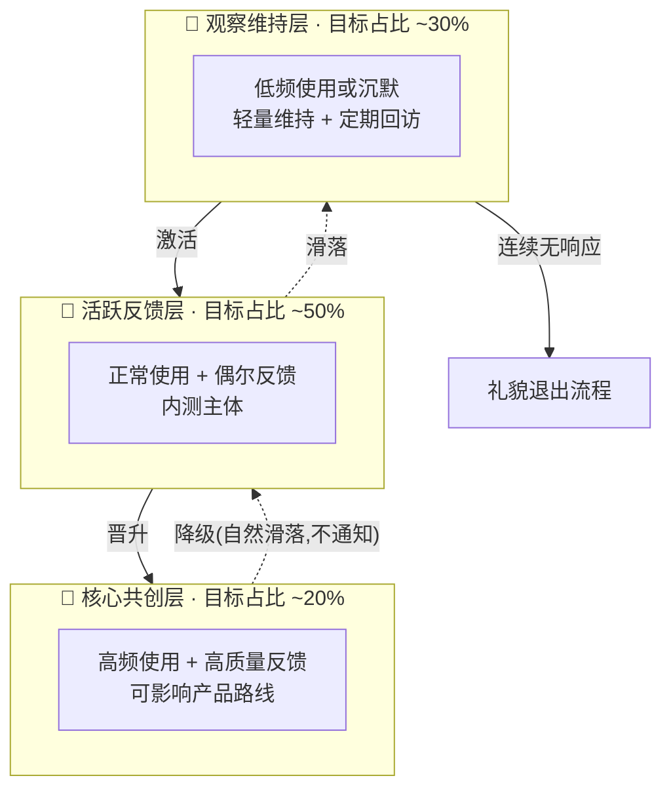

# 熵减内测用户分层管理方案

> 配套文档：[内测招募与运营手册](./beta-recruitment-playbook.md) §5.1 · [内测协议](./beta-agreement.md) · [招募公告](./beta-recruitment-announcement.md)
> 定位：把手册 §5.1 的分层概念落成可执行的制度——**谁在哪一层、怎么升降、每层给什么、我对每层花多少精力**。
> 理论基础：自我决定理论（自主感/胜任感/归属感）、峰终定律、二八法则（80% 的高质量反馈来自 20% 的用户）。

---

## 0. 何时启用分层

| 阶段 | 人数 | 策略 |
|------|------|------|
| 阶段一 | ≤10 人 | **不分层**。人人都是核心，全部一对一深聊，分层此时是过度设计 |
| 阶段二 | 10-50 人 | 启用本方案三层结构 |
| 阶段三 | 50+ 人 | 增设"荣誉层"（毕业内测员/布道者），进入公测过渡（手册 §7） |

> ⚠️ 单人开发者的铁律：**分层的目的是省精力，不是加工作量**。任何一层的运营动作如果让你连续两周做不完，砍动作，不砍层。

---

## 1. 三层结构总览

## 2. 分层标准（可量化）

以**滚动两周**为观察窗口，满足任意判定条件即归入该层：

| 层级 | 使用频次 | 反馈质量 | 附加信号 |
|------|---------|---------|---------|
| 🌟 核心共创 | ≥3 次/周 | 累计 ≥2 条深度反馈（含场景+建议）或 ≥1 个有效 Bug | 主动提问、接受过访谈、发出过邀请码 |
| 🌊 活跃反馈 | ≥1 次/周 | 有反馈记录（吐槽也算） | 群内有互动 |
| 🫧 观察维持 | <1 次/周 | 两周无反馈 | 消息已读不回 ≠ 流失，先按 §5.4 排除考试周因素 |

**判定说明**：

- 数据来源：使用频次看匿名统计（协议第三条已授权）；反馈质量人工判定，与[有偿内测质量奖励](./beta-agreement.md)的认定共用一套标准，不重复劳动。
- **宁升勿降**：边界情况一律往高层放——错把核心用户当潜水者的代价（被重视感崩塌）远大于反过来。

## 3. 各层权益与运营动作

### 🌟 核心共创层（预计 5-10 人）

**权益**（满足自我决定理论三要素）：

- 路线图共创权：新功能做不做、先做哪个，小群内直接讨论（自主感）
- 新版本提前 3-5 天体验（尝鲜通道）
- 更新日志署名感谢 + 期末"核心共创者"证书（胜任感）
- 进入核心小群，与开发者即时对话（归属感）

**我的运营动作**（每周预算：约 2 小时）：

- 每周至少 1 次一对一深聊（轮流，不必每人每周）
- 新版本发布前先发小群征求意见
- 他们的反馈 24 小时内回应（对外承诺仍是 48h，内部对这层提速——超额兑现制造峰值时刻）

### 🌊 活跃反馈层（内测主体）

**权益**：

- 内测标准权益（协议第一条全部内容）
- 反馈被采纳同样署名感谢
- 月度"反馈之星"评选资格

**我的运营动作**（每周预算：约 1 小时）：

- 大群周报（复用手册 §5.2 的真实数据周报，一次编写全员触达）
- 反馈 48 小时内回应（按协议兑现即可）
- 每两周从中挑 1-2 人尝试深聊——**这是晋升核心层的主要通道**

### 🫧 观察维持层

**权益**：不剥夺任何协议权益（基础酬劳仍按协议结算），只降低触达频率。

**我的运营动作**（每周预算：约 20 分钟）：

- 不主动打扰，仅接收周报
- 每两周一次轻量回访，**只问一个具体问题**："是太忙了，还是软件哪里让你用不下去了？"——后者是金子级反馈（流失原因比功能建议更值钱）
- 回访话术保持 §2.4 破冰原则：引用他上次说过的话，不发模板

## 4. 升降级机制

### 晋升（要有仪式感）

- 触发：达到上一层标准，且我主观判断匹配（人少，人工判定完全够用）。
- 动作：**私聊正式邀请**，说清为什么是他（"你上次关于课堂助手笔记结构的建议我改了，想拉你进核心群一起定后面的方向"）——引用具体贡献，这就是峰终定律的"峰值时刻"。
- 🚫 不要群发"恭喜晋升"名单——分层制度本身**对用户不完全公开**（见 §6 红线）。

### 降级（静默处理，绝不通知）

- 核心层用户连续 3 周无互动 → 我停止对他的高频动作，自然回到活跃层节奏；**群不踢、权益不收、不发任何"你被降级了"的信号**。
- 理由：降级通知只会制造羞辱感和流失；静默滑落成本为零，且他随时活跃回来就随时恢复。

### 退出流程（观察层 → 出局）

- 观察层连续 2 次回访无响应（排除考试周/假期后）→ 发一条**留面子的收尾消息**：
  > "看你最近比较忙，内测这边你随时想回来都在。如果不方便继续，也跟我说一声，酬劳按协议给你结算～"
- 对方明确退出或仍无响应 → 按协议第五条结算酬劳、7 天内删除个人信息。**善终也是运营**：今天体面退出的人，是明天正式版的潜在用户。

## 5. 落地工具（单人够用版）

**用户档案表**（一张表管所有人，Excel/Notion 均可）：

| 字段 | 示例 | 来源 |
|------|------|------|
| 昵称/联系方式 | — | 报名表 |
| 当前层级 | 🌊 活跃 | 每两周滚动更新 |
| 学习场景 | 考研数学 | §2.4 破冰记录 |
| 核心痛点 | 网课笔记低效 | §2.4 破冰记录 |
| 现用工具 | Notion + 纸笔 | §2.4 破冰记录 |
| 反馈记录 | 3 条（1 深度） | 反馈台账，与酬劳结算共用 |
| 上次互动 | 07-28 深聊 | 手动记 |
| 备注 | 8 月考试，暂勿打扰 | — |

**群组架构**：

- 「熵减内测群」：全员大群，发周报、版本通知（活跃层 + 观察层的主触达面）
- 「熵减核心群」：核心层小群，≤10 人，讨论路线图
- 不再多建群——两个群是单人运营的上限

**每周固定节奏（合计 ≤4 小时）**：

| 时间 | 动作 | 覆盖层 |
|------|------|--------|
| 周一 | 更新用户档案表层级 + 处理积压反馈 | 全部 |
| 周三 | 1-2 次一对一深聊 | 核心层为主 |
| 周五 | 大群周报 + 核心群下周计划 | 全部 |
| 隔周五 | 观察层轻量回访 | 观察层 |

## 6. 红线与提醒 🚫

- **分层对用户半公开**：核心群的存在可以知道（制造向往感），但完整分层标准、谁在哪层、降级机制**不公开**——公开的等级制度会把共创氛围变成 KPI 竞赛，还会羞辱低层用户。
- **层级 ≠ 人的价值**：观察层的一条流失原因反馈，可能比核心层十条功能建议更重要（幸存者偏差对冲，手册 §4）。
- **酬劳与层级脱钩**：内测酬劳按[协议](./beta-agreement.md)统一结算，不因层级打折——分层是运营精力的分配方案，不是薪酬等级。
- 档案表含用户个人信息，本地保存、不上云共享文档，退出用户 7 天内从表中删除（对齐协议第五条）。
