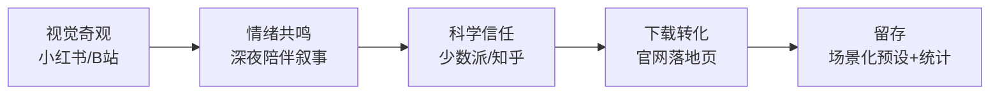

# 深潜（番茄钟）宣传推广方案 v1.0

> **定位**：熵减核心功能「深潜（番茄钟）」的对外宣传执行手册。
> **日期**：2026-08-11
> **前提**：单人开发者、零预算、内容即渠道；宣传目标为认知→兴趣→下载→留存的完整漏斗。
> **关联**：[内测招募与运营手册](./beta-recruitment-playbook.md) · [品牌故事](./brand-story.md) · [痛点图谱](./pain-points.md)

---

## 0. 总览



- **核心洞察**：传统番茄钟都在"计时"，Chronos 在"养育一个生命体"——从效率工具到时间伙伴的品类跃迁。六态形态粒子动画是零预算时代最稀缺的传播资产，且竞品抄不走。
- **零预算杠杆公式**：内容即渠道——每一篇内容同时是广告、是教程、是口碑素材。

---

## 1. 信息架构：一句话主张 + 三个支柱

> **主信息：这不是番茄钟，是你养的一只"时间生物"。**

| 支柱 | 对谁说 | 传递什么 | 对应的产品事实 |
|---|---|---|---|
| **视觉奇观**（钩子） | 泛学习人群 | 时间被做成了看得见的生命 | 六态形态粒子动画（沉睡→呼吸→专注→短休→长休→划时代点）、粒子随倒计时消散、色温渐变 |
| **反焦虑陪伴**（共鸣） | 深夜独学、拖延内耗人群 | 学习不该是苦行，没有红色惩罚 | 沉睡→呼吸→专注两步式交互、不催促不评判、失败注入柔粉而非红色 |
| **科学节律**（信任） | 工具党、终身学习者 | 25 分钟是错的，你的节律该由你定义 | 超昼夜节律（P39 节律错配）、场景化预设（刷题 50/10、背单词 15/3、晚自习 90/20） |

**纪律**：每条内容必须同时满足"服务至少一个支柱"与"推进转化路径一步"，宁缺毋滥。

---

## 2. 内容钩子矩阵

### 2.1 小红书（视觉 + 情绪主战场，首发冷启动）

| 选题 | 形式 | 钩子逻辑 |
|---|---|---|
| 「我把番茄钟养活了」 | 15-30s 六态动画录屏 | 视觉奇观，3 秒抓人 |
| 「专注时它会燃烧，休息时它会发芽🌱」 | 专注→短休 转场特写 | 形态即情绪，第一次意识到"番茄钟可以这样" |
| 「深夜 23 点，它只剩一抹暗红余烬」 | 深夜场景 + 沉睡形态 | 反焦虑陪伴，共鸣孤独感 |
| 「为什么我的番茄钟是 50 分钟不是 25」 | 预设切换录屏 | 科学节律的轻量表达，埋下载钩子 |

### 2.2 B 站（深度视频 + 评论区长尾）

| 选题 | 形式 | 钩子逻辑 |
|---|---|---|
| 「我花 3 个月把番茄钟做成了活物（开发日记）」 | 5-8 分钟 Build in Public | 单人开发真实感 + 视觉奇观，学习区稀缺内容 |
| 「别再用 25 分钟番茄钟了」 | 3-5 分钟科普 + 演示 | 反常识标题 + 认知科学，适合转发收藏 |
| 评论区运营 | 每条视频下自评 + 回复 | "如果你也熬夜自习，试试这个"——把评论区变成第二内容场 |

### 2.3 少数派 / 知乎（信任背书，漏斗底部）

| 选题 | 形式 | 钩子逻辑 |
|---|---|---|
| 《番茄钟的尽头不是计时，是陪伴：Chronos 设计笔记》 | 3000 字长文 | 设计哲学 + 本地优先数据主权，工具党最爱 |
| 《场景化番茄钟：为什么刷题、背单词、晚自习需要三种节律》 | 方法论文 | 直接对标 P39 节律错配痛点，建立专业认知 |

---

## 3. 分阶段打法（三波段）

### 第一波 · 视觉种子期（第 1-2 周）

- **目标**：验证哪种形态最有传播力（看数据选主推素材）
- **动作**：小红书发 3-5 条视觉内容测水；同步准备 B 站长视频素材
- **判断标准**：点赞收藏率、评论区"这是什么软件"出现频次

### 第二波 · 开学季爆发期（8 月底-9 月，黄金窗口）

- **目标**：吃学生开学 + 考研冲刺两大流量潮
- **动作**：
  - B 站开发日记 + 反常识科普上线
  - 小红书切换"开学自救"叙事（"新学期别从 25 分钟开始"）
  - 考研群/学习群破冰按 [playbook 破冰 SOP](./beta-recruitment-playbook.md#24-加上微信后的第一次对话破冰-sop) 执行
- **判断标准**：下载转化数、内测申请量

### 第三波 · 深度信任期（9 月中-10 月）

- **目标**：把流量沉淀为口碑
- **动作**：
  - 少数派/知乎长文上线
  - 邀请 2-3 位学习区 KOC 试用（零预算策略：专属内测资格 + 素材包 + 更新日志署名，交换真实体验贴）
- **判断标准**：官网自然搜索、次周留存、PMF 测试样本

---

## 4. 转化路径设计

```
看动画(小红书/B站) → 评论区问"这是什么" → 主页链接/私信自动回复
  → 官网下载页 → 首次打开（沉睡形态）→ 点一下激活呼吸 → 再点开始专注
  → 完成第一个番茄 → 看到粒子消散与萌芽 → 留存（场景化预设 + 统计）
```

### 三个关键转化设计

1. **评论区即转化漏斗**：每条内容主动在评论区自评引导——"想养一只？官网免费下载"。私信自动回复设关键词"下载"。
2. **首次体验即魔法时刻**：两步式交互（沉睡→呼吸→专注）本身就是最自然的 onboarding，宣传中反复强调"你只需要点它两下"——降低尝试门槛感知。
3. **官网"深潜"专题落地页**（产品动作，待立项）：当前官网首页仅功能卡一句话，转化路径断在"看完动画→官网找不到番茄钟详情"。需新增深潜专区页：六态动画 + 场景化预设说明 + 下载 CTA。

---

## 5. 排期与度量

### 节奏纪律（单人开发者铁律）

- 固定低频，不承诺高频：每周 2-3 条动态（工作日干货、晚间/周末共鸣）
- 所有承诺按"最差状态也能兑现"的标准定（同 [playbook §5.3](./beta-recruitment-playbook.md#53-人设与触达节奏)）
- **避开考试周**发新版本/求反馈；宣传内容在考试周前发力（焦虑期是工具下载高峰）

### 度量表

| 阶段 | 北极星 | 辅助指标 |
|---|---|---|
| 种子期 | 内容互动率 | 评论"这是什么软件"频次、收藏率 |
| 爆发期 | 下载转化数 | 内测申请量、激活率（完成 1 个完整番茄） |
| 信任期 | 次周留存率 | 场景化预设使用率、PMF 测试 ≥40% |

---

## 6. 红线与合规（沿用 playbook §6.3）

- 只放大真实亮点，**不虚构数据、不伪造用户反馈**
- 用户故事需脱敏授权；收集用户信息受《个人信息保护法》约束
- "本地优先、数据在用户自己电脑"是合规与信任的双重优势，宣传话术反复强化（对齐"记忆主权·本地世界"第一叙事）

---

## 7. 执行清单

### 准备阶段（第 0-1 周）
- [ ] 建立素材库：六态动画录屏（双主题）、粒子消散特写、预设切换录屏
- [ ] 小红书/B站账号装修（头像、简介挂官网链接）
- [ ] 私信自动回复关键词"下载"配置
- [ ] 撰写《内测招募公告》变体（视觉向 + 科学向两版文案）

### 种子期（第 1-2 周）
- [ ] 小红书 3-5 条视觉内容测水，按数据选主推形态
- [ ] B 站开发日记剪辑与发布
- [ ] 记录各条内容转化数据（评论、私信、下载）

### 爆发期（8 月底-9 月）
- [ ] B 站反常识科普发布
- [ ] 小红书"开学自救"叙事切换
- [ ] 考研群/学习群破冰（playbook SOP）
- [ ] 官网"深潜"落地页上线（若立项）

### 信任期（9 月中-10 月）
- [ ] 少数派/知乎长文发布
- [ ] 2-3 位学习区 KOC 邀请与素材包发放
- [ ] 次周留存与 PMF 测试复盘
- [ ] 公示"因你而改"清单，沉淀口碑
